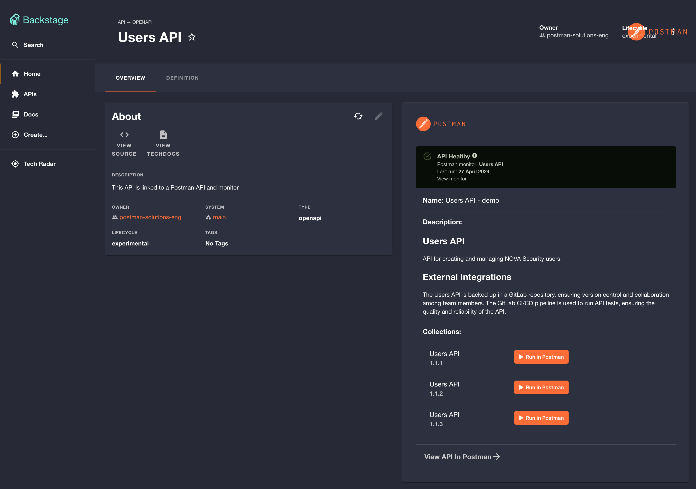
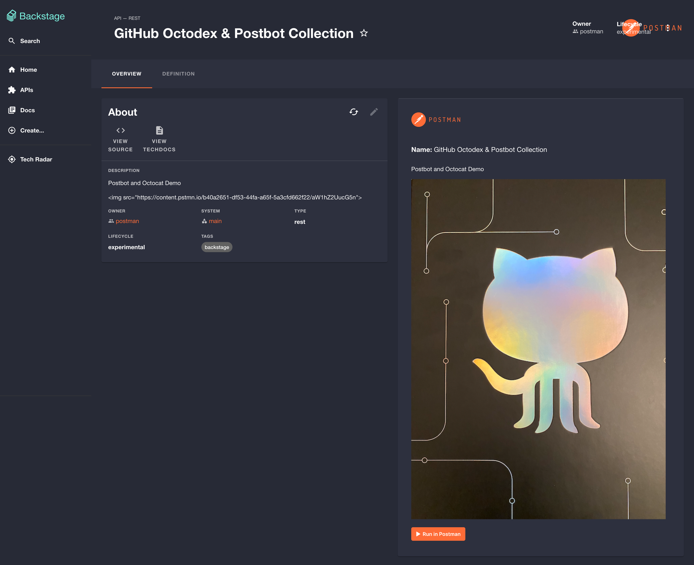
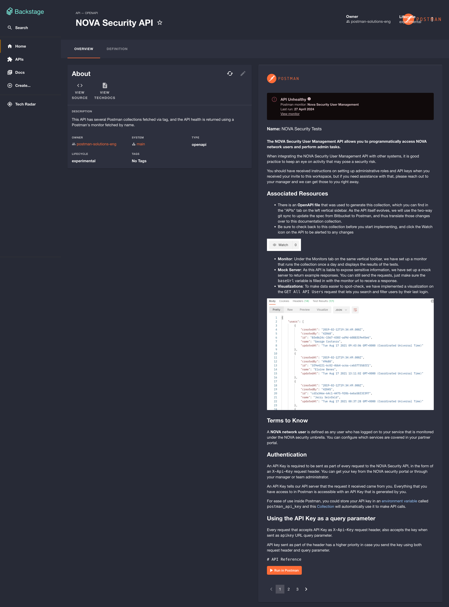

<p align="center">
  
</p>
<h1 align="center">Postman Plugin For Backstage</h1>

This plugin is designed to seamlessly integrate Postman functionality into your Backstage application. It simplifies the addition of a Postman card to your API views and enables dynamic retrieval of Postman resources like collections and APIs. By linking your APIs with Postman collections or APIs, it empowers consumers to interact effortlessly with these resources within the Postman interface. This includes features such as a `Run in Postman` button and the ability to dynamically fetch collections or APIs from Postman and adding them to your API list using an `Entity Provider`.

# Table of Contents
- [Disclaimer](#disclaimer)
- [Plugin Features](#plugin-features)
  - [API View](#api-view)
  - [Collections View](#collections-view)
  - [Monitor View](#monitor-view)
  - [Coming soon](#coming-soon)
- [Installation](#installation)
- [Configure Postman Frontend Plugin for Backstage](#configure-postman-frontend-plugin-for-backstage)
- [Configure Postman Backend Plugin for Backstage](#configure-postman-backend-plugin-for-backstage)
  - [Prerequisites](#prerequisites)
  - [Configuration Guide](#configuration-guide)
      - [Basic Configuration](#basic-configuration)
      - [Advanced Configuration](#advanced-configuration)
  - [Configuring the Postman Entity Provider (optional)](#configuring-the-postman-entity-provider-optional)
- [Postman Metadata Guide](#postman-metadata-guide)
  - [Metadata Object Overview](#metadata-object-overview)
  - [Common Parameters](#common-parameters)
  - [APIs](#apis)
  - [Collections (Use collection tag or IDs)](#collections-use-collection-tag-or-ids)
  - [Monitors (Use monitor ID or name)](#monitors-use-monitor-id-or-name)


# Disclaimer
This plugin is not officially supported by Postman and is intended for Backstage users to easily integrate Postman into their API documentation.

# Plugin Features

This plugin offers several views which you can use to display published API information stored in Postman, show collections with a *Run In Postman* button and allows you to view your Postman monitor results on the API page.

## API View 

Displays your published Postman API data in Backstage, allowing you to access both the API information and the published API collections.



Refer to the [Postman API Metadata](#APIs) to see the parameters needed to display this view.

## Collections View 

Displays the collection(s) of a given API stored in Postman. This view includes a *Run in Postman* button, which is activated based on the collection ID(s) or tag defined in the `entities.yaml` file.



Refer to the [Postman Collections Metadata](#monitors-use-monitor-id-or-name) to see the parameters needed to display this view.

## Monitor View 

Shows the health of your API as determined by the monitor in Postman. The monitor can be displayed using either its `name` or `id`. 



For more details, refer to [this section](#monitors-use-monitor-id-or-name).

## Add Postman Collections and APIs dynamically to the catalog using Postman Tags

You can also use this plugin to fetch **Postman APIs** or **collections** dynamically using Postman tags. Please refer to [this section](#configuring-the-postman-entity-provider-optional) for more details.


## Coming soon 

A *Governance Checks* view will be added in future versions of this plugin.

# Installation

```sh
# From your Backstage root directory
yarn --cwd packages/app add @postman-solutions/backstage-plugin-postman
yarn --cwd packages/backend add @postman-solutions/postman-backstage-backend-plugin
```

Then, you would need to configure both plugins as descried in the next two sections.

# Configure Postman Frontend Plugin for Backstage

The Postman frontend plugin enables you to link your APIs to their corresponding collections, published APIs, and monitors within Postman. You can also discover APIs and collections within your Postman Team that have been tagged with a tag of your choice and add them to the catalogue.

It is a community-driven initiative to extend Backstage functionalities with Postman.

## Dependencies

*Important:* Please note that the frontend plugin will not function without the backend plugin.

Refer to the installation steps for the backend plugin [here]([https://github.com/postman-solutions-eng/backstage-postman-plugin?tab=readme-ov-file#configure-postman-backend-plugin-for-backstage](https://github.com/postman-solutions-eng/backstage-postman-plugin?tab=readme-ov-file#installation)).

## Getting Started

1. Configure your Postman API key in your local `app-config.yaml` or production `app-config.production.yaml` file:

> [!CAUTION]
> The `apiKey` in the configuration should not belong to an admin or super admin user, as this would grant access to all collections and APIs in the team. Instead, use an `apiKey` from a user that has access only to the information that can be safely displayed to the authenticated developer audience in Backstage. This principle of least privilege helps to maintain tight control over your Postman data and reduces the potential impact if a user adds a reference to an entity in a private workspace or accidentally tags a private API with the tag used by the Postman entity provider.

```yaml
postman:
    baseUrl: https://api.postman.com
    apiKey: ${YOUR_API_KEY_HERE}
```

To get a Postman API Key, follow the instructions [here](https://learning.postman.com/docs/developer/postman-api/make-postman-api-call/#get-your-api-key).

2. Import and add the <PostmanCard /> component in your `packages/app/src/components/Catalog/EntityPage.tsx` page to display the Postman card on your API page. 

``` ts
// ... other imports here
import { PostmanCard } from '@postman-solutions/backstage-plugin-postman';
// ... other components
const apiPage = (
  <EntityLayout>
    <EntityLayout.Route path="/" title="Overview">
    // ... other elements
    <Grid item md={6} xs={12}>
      <PostmanCard />
    </Grid>
    // ... other elements
    </EntityLayout.Route>
  </EntityLayout>
// ...
);
// ...
```

# Configure Postman Backend Plugin for Backstage

This `postman-backend` plugin provides some Postman services that will be used by the Postman frontebd plugin to render the different component views.

## Prerequisites

Before you begin, ensure you have the following:

- Make sure the Postman Frontend Plugin is already installed and configured
- A running instance of Backstage
- Node.js and npm installed (Node.js 18.x or later is recommended)
- Access to Postman API credentials

## Configuration Guide

This guide provides instructions for configuring your application to interact with the Postman API using the `app-config.yaml` file. Follow the steps below to set up your environment correctly.

### Basic Configuration

**API Key Setup**: First, make sure to include the base URL and set an environment variable `POSTMAN_API_KEY` with your Postman API key in the configuration file if not done already.

> [!CAUTION]
> The `apiKey` in the configuration should not belong to an admin or super admin user, as this would grant access to all collections and APIs in the team. Instead, use an `apiKey` from a user that has access only to the information that can be safely displayed to the authenticated developer audience in Backstage. This principle of least privilege helps to maintain tight control over your Postman data and reduces the potential impact if a user adds a reference to an entity in a private workspace or accidentally tags a private API with the tag used by the Postman entity provider.

```yaml
    postman:
        baseUrl: https://api.postman.com
        apiKey: ${POSTMAN_API_KEY}
```

### Advanced Configuration

1. **Entity Provider Setup**: The plugin includes an entity provider to fetch API assets from Postman periodically using a Postman tag. Tags can be added to [collections](https://learning.postman.com/docs/collections/using-collections/#tagging-a-collection) or [Postman APIs](https://learning.postman.com/docs/designing-and-developing-your-api/managing-apis/#tagging-apis). To use this option, please add the following settings to your `app-config.yaml`:

    | Parameter | Schema Type | Optional | Description |
    | --------- | ----------- | -------- | ----------- |
    | `postman/team` | string | Yes | Name of your Postman team. For a team URL like `https://myteam.postman.co`, your team name would be `myteam.postman.co`. |
    | `postman/owner` | string | Yes | Owner of the API assets. Default is "postman". Consider creating a User or Group for this owner. |
    | `postman/synchEntitiesWithTag` | string | Yes | Postman tag used to fetch API assets. |
    | `postman/entityProviderSynchInterval` | string | Yes | Interval (in hours) for fetching the API assets from Postman. |
    | `postman/system` | string | Yes | System of the API assets. Default is "main". |

    Example configuration:

  ```yaml
    postman:
        baseUrl: https://api.postman.com
        apiKey: ${POSTMAN_API_KEY}
        team: my-team.postman.co
        synchEntitiesWithTag: backstage
        owner: postman-team
        entityProviderSynchInterval: 2
        system: my-system
  ```

2. **Caching Options**: The Postman backend plugin supports caching. Configure cache settings by adding the following properties:

    | Parameter | Schema Type | Optional | Description |
    | --------- | ----------- | -------- | ----------- |
    | `postman/cache/ttl` | number | Yes | Cache expiry time in milliseconds. Default is 600000 (10 minutes). |

    Example configuration for a custom cache duration:

    ```yaml
    postman:
        baseUrl: https://api.postman.com
        apiKey: ${POSTMAN_API_KEY}
        team: my-team.postman.co
        cache:
          ttl: 300000  # 5 minutes
    ```

If you do not like to apply caching / get quicker updates when new entities get tagged, set a ttl to 0 or a value smaller than the entity service refresh interval.

### Add the backend plugin to your Backstage application 

1. Create a new file named `packages/backend/src/plugins/postmanbackend.ts`, and add the following to it:

```ts
import { PluginEnvironment } from '../types';
import { createRouter } from '@postman-solutions/postman-backstage-backend-plugin';

export default async function createPlugin({
  logger,
  config,
}: PluginEnvironment) {
  return await createRouter({ logger, config });
}
```

2. Next, let's wire this into the overall backend router, edit `packages/backend/src/index.ts`:

```ts
import postmanbackend from './plugins/postmanbackend';
// ...
async function main() {
  // ...
  // Add this line under the other lines that follow the useHotMemoize pattern
  const postmanBackEndEnv = useHotMemoize(module, () => createEnv('postman-backend'));
  // ...
  // Insert this line under the other lines that add their routers to apiRouter in the same way
  apiRouter.use('/postman', await postmanbackend(postmanBackEndEnv));
// ...
}
```

3. (optional), you can run `yarn start-backend` from the root directory to start the backend server

## Configuring the Postman Entity Provider (optional)

The Postman EntityProvider is an optional component that allows you to dynamically retrieve Postman APIs and collections that have been tagged with a certain Postman tag, e.g. `backstage`.
In order for it to work, you would need to add some more properties to your local `app-config.yaml` or production `app-config.production.yaml` file:

```yaml
postman:
    baseUrl: https://api.postman.com
    apiKey: ${POSTMAN_API_KEY}
    synchEntitiesWithTag: TAG_NAME
    entityProviderSynchInterval: SYNC_FREQUENCY_IN_MINUTES (optional)    
```

Additionally, you would need to insert the following lines into your `packages/backend/src/plugins/catalog.ts` file:

``` ts
...
// new code after other imports
import { PostmanEntityProvider } from '@postman-solutions/postman-backstage-backend-plugin';
import { CacheManager } from '@backstage/backend-common';
...

...
    const builder = CatalogBuilder.create(env);
    
    // new code after builder got instantiated
    const cacheManager = CacheManager.fromConfig(env.config);
    const cache = cacheManager.forPlugin('postman').getClient({defaultTtl: env.config?.getNumber('postman.cache.ttl') ?? 60000 })
    const postmanEntityProvider = PostmanEntityProvider.fromConfig(env.config, {logger: env.logger, cache})
    const postmanEntityProviderSynchInterval = env.config?.getNumber('postman.entityProviderSynchInterval') ?? 5;
    builder.addEntityProvider(postmanEntityProvider);

...

...
    await processingEngine.start();

    // new code after processing engine started
    await env.scheduler.scheduleTask({
      id: 'run_postman_entity_provider_refresh',
      fn: async () => {
        await postmanEntityProvider.run();
      },
      frequency: { minutes: postmanEntityProviderSynchInterval },
      timeout: { minutes: 10 },
    });
...
```

# Postman Metadata Guide

## Metadata Object Overview

This section provides an overview of the metadata object for this Postman plugin in the context of the Backstage implementation. All parameters should only be defined with the `kind: API` in your YAML file. 

All three options, API, Collections, and Monitor, can be used in conjunction.

## Common Parameters

These parameters are common across different kinds of entities:

| Parameter | Schema Type | Optional | Description |
| --------- | ----------- | -------- | ----------- |
| `postman/domain` | string | Yes | The sub-domain of your Postman instance. E.g. if your Postman URL is `postman-demo.postman.co`, use `postman-demo`. If not defined, the application will use `go.postman.co` to redirect users to Postman. |
| `postman/workspace/id` | string | No | The ID of your Postman workspace. This ID will be used to construct the links to redirect to Postman.  |

```yaml
apiVersion: backstage.io/v1alpha1
kind: API
metadata:
  name: calculation-grpc-api
  postman/domain: "postman-demo"
  postman/workspace/id: "YOUR_WORKSPACE_ID_HERE"
```

## APIs

| Parameter | Schema Type | Optional | Description |
| --------- | ----------- | -------- | ----------- |
| `postman/api/id` | string | No | The ID of your Postman API. |
| `postman/api/name` | string | Yes | (optional) The name of your Postman API. If referenced, this value will be used to fetch the API Postman monitor(s) using the API name. |


### Using the API ID
```yaml
apiVersion: backstage.io/v1alpha1
kind: API
metadata:
  name: calculation-grpc-api
  postman/domain: "postman-demo"
  postman/workspace/id: "YOUR_WORKSPACE_ID_HERE"
  postman/api/id: "YOUR_POSTMAN_API_ID_HERE"
```

### API with API name
```yaml
apiVersion: backstage.io/v1alpha1
kind: API
metadata:
  name: calculation-grpc-api
  postman/domain: "postman-demo"
  postman/workspace/id: "YOUR_WORKSPACE_ID_HERE"
  postman/api/id: "YOUR_POSTMAN_API_ID_HERE"
  postman/api/name: "YOUR_POSTMAN_API_NAME"
```

## Collections (Use collection tag or IDs)

| Parameter | Schema Type | Optional | Description |
| --------- | ----------- | -------- | ----------- |
| `postman/collection/id` | string | Yes | The ID of your Postman collection. |
| `postman/collections/ids` | array | Yes | An array of IDs of your Postman collections. |
| `postman/collections/tag` | string | Yes | A string specifying the collection tag to retrieve. |
| `postman/collections/pagination` | string | Yes | A 'true' or 'false" value to indicate whether you want to paginate through the results. |

### Get collection by ID
```yaml
apiVersion: backstage.io/v1alpha1
kind: API
metadata:
  name: calculation-grpc-api
  postman/collection/id: "YOUR_COLLECTION_ID"
```

### Using collection tag
```yaml
apiVersion: backstage.io/v1alpha1
kind: API
metadata:
  name: calculation-grpc-api
  postman/collections/pagination: 'true'
  postman/collections/tag: "YOUR_COLLECTION_TAG_HERE"
```

### Using collection IDs
```yaml
apiVersion: backstage.io/v1alpha1
kind: API
metadata:
  name: calculation-grpc-api
  postman/collections/ids: ["YOUR_FIRST_COLLECTION_ID", "YOUR_SECOND_COLLECTION_ID"]
```

## Monitors (Use monitor ID or name)

| Parameter | Schema Type | Optional | Description |
| --------- | ----------- | -------- | ----------- |
| `postman/monitor/id` | string | No | The ID of your Postman monitor. |
| `postman/monitor/name` | string | No | The name of your Postman monitor. |

### Using monitor id
```yaml
apiVersion: backstage.io/v1alpha1
kind: API
metadata:
  name: calculation-grpc-api
  postman/monitor/id: "YOUR_MONITOR_ID_HERE"
```

### Using monitor name
```yaml
apiVersion: backstage.io/v1alpha1
kind: API
metadata:
  name: calculation-grpc-api
  postman/monitor/name: "YOUR_MONITOR_NAME_HERE"
```


## License

This project is licensed under the [MIT License](LICENSE). Feel free to use, modify, and distribute the code according to the terms of the license.

## Contributing
Thank you for considering contributing to this project! Please check out the [contribution guidelines](CONTRIBUTING.md) for more information on how to get started.

## Code of Conduct

We expect all contributors to adhere to the [Code of Conduct](CODE_OF_CONDUCT.md). Please review the guidelines before contributing to ensure a positive and inclusive community for everyone.

## Contact

If you have any questions, concerns, or suggestions regarding this project, feel free to contact [@aphanor-postman](https://github.com/aphanor-postman) or [@jonico](https://github.com/jonico).
