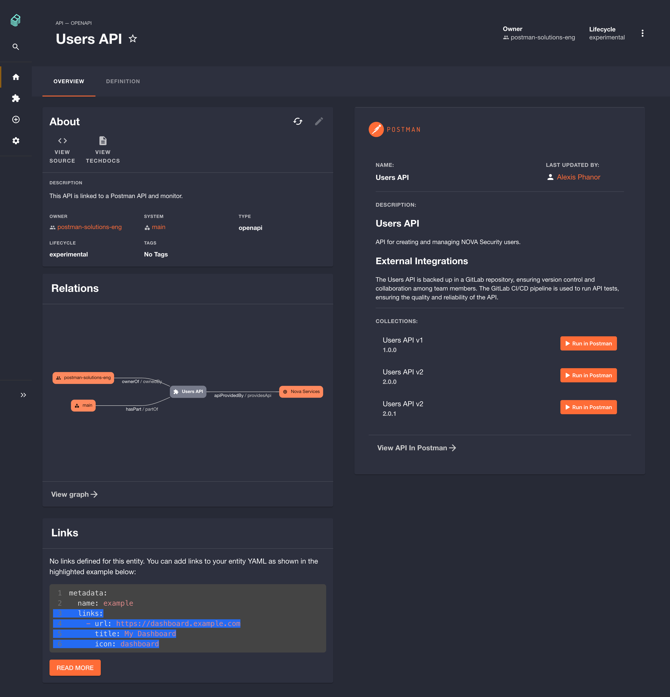

<p align="center">
  
</p>
<h1 align="center">Postman Plugin For Backstage</h1>

This plugin integrates Postman functionality into your Backstage application,
enabling you to display API information, collections, and monitor data. It
consists of two complementary parts:

- A frontend plugin for displaying Postman cards on your API pages.
- A backend plugin that proxies requests between your application and the
  Postman API.

# Table of Contents

- [Disclaimer & Compatibility](#disclaimer--compatibility)
- [Plugin Features](#plugin-features)
  - [API View](#api-view)
  - [Collections View](#collections-view)
  - [Collection Linker](#collection-linker)
  - [Catalog APIs using Postman Tags](#catalog-apis-using-postman-tags)
  - [Monitor View](#monitor-view)
- [Installation](#installation)
- [Configure Postman Frontend Plugin](#configure-postman-frontend-plugin)
  - [Optional Configuration](#optional-configuration)
- [Configure Postman Backend Plugin](#configure-postman-backend-plugin)
- [Backend Content Security Policy](#backend-content-security-policy)
- [Postman Metadata Guide](#postman-metadata-guide)
  - [Overview](#overview)
  - [Common Parameters](#common-parameters)
  - [APIs](#apis)
  - [Collections](#collections)
  - [Monitors](#monitors)
- [License, Contributing & Contact](#license-contributing--contact)

# Disclaimer & Compatibility

This plugin is community-driven and is not officially supported by Postman Inc.
The latest release has been tested on Backstage v1.35+ and may not be compatible
with older versions. Please refer to the plugin releases for compatibility
details with older Backstage versions.

# Plugin Features

- Display one or multiple Postman collections on your API pages.
- Display published APIs created in Postman along with their versions and
  associated collections on your API pages.
- Show Postman monitor health information.
- Dynamically fetch Postman assets using tags (catalog integration using
  EntityProvider).
- Use the Collection Linker to dynamically attach Postman collections to your
  APIs.

### Collections View

Shows collections associated with an API, including a _Run in Postman_ button
that uses collection IDs or tags defined in `entities.yaml`.

- **Postman Backstage Demo Site**:
  [Explore the Nova Security API](https://backstage.postmansolutions.com/catalog/default/api/nova-security-api)
- **Postman Collection**:
  [View the Nova Security User Management Collection in Postman](https://www.postman.com/technology-demo/postman-backstage-plugin-demo-resources/documentation/zr0gjtu/nova-security-user-management)


_For parameter details, see [Postman Metadata Guide](#postman-metadata-guide)._

### Collection Linker [NEW]

The Collection Linker feature lets you dynamically attach one or more Postman
collections to an API. When linked, collections are automatically tagged using
the format `postman-plugin-{API_NAME}-tag`, allowing you to easily manage and
update connections via the Postman Card. This option appears only for APIs that
do not have existing Postman metadata defined.

> [!CAUTION]
> The **Collection Linker** should _only_ be used if your Backstage application
> is _authentication protected_. This feature is disabled by default. To enable
> it, set the following flag in your `app-config.yaml` or
> `app-config.production.yaml` file:

> ```yaml
> postman:
>   collectionLinker:
>     enabled: true
> ```

- **Postman Backstage Demo Site**:
  [Test the Collection Linker Here](https://backstage.postmansolutions.com/catalog/default/api/empty-api)


### Limiting Workspace Visibility

By default, the _**Collection Linker**_ fetches data from team and public
workspaces created in your Postman team. To change the visibility, set the
`workspaceVisibility` flag in your `app-config.yaml` or
`app-config.production.yaml` file:

```yaml
postman:
  baseUrl: https://api.postman.com # For EU data center, use: https://api.eu.postman.com
  apiKey: ADD_YOUR_POSTMAN_API_KEY
  collectionLinker:
    workspaceVisibility: "public"
```

> [!CAUTION]
> We recommend using only 'team' or 'public' visibility to avoid exposing
> sensitive data stored in private, partner, or personal workspaces. Enabling
> other workspace types might expose workspaces that are not accessible to all
> Backstage users, limiting the benefit of this feature.

_For more information, see [Postman Metadata Guide](#collection-linker)._

### Catalog APIs using Postman Tags

Easily fetch and populate your Backstage API catalog with Postman APIs and
collections from your Postman team using the Postman **EntityProvider**, which
relies on Postman tags.


In this example, our entity provider fetches all assets tagged with
`backstage-plugin` from Postman.

### Monitor View

Presents API health based on Postman monitor data. The monitor can be configured
using its `name` or `id`.


_For more information, see [Postman Metadata Guide](#postman-metadata-guide)._

### API View

Displays your published Postman API data in Backstage, allowing you to access
both API details and related collections.

- **Postman Backstage Demo Site**:
  [Explore the Users API](https://backstage.postmansolutions.com/catalog/default/api/users-api)
- **Postman API Builder**:
  [View the Users API in Postman](https://www.postman.com/technology-demo/postman-backstage-plugin-demo-resources/api/96f32c87-9d6f-4578-b8ae-688cef1284ac?version=deda98eb-f163-4780-ba4b-acb11c27141c)



_For parameter details, see [Postman API Metadata](#apis)._

# Installation

Install the plugins from your Backstage root using the following commands:

```sh
yarn --cwd packages/app add @postman-solutions/postman-backstage-plugin
yarn --cwd packages/backend add @postman-solutions/postman-backstage-backend-plugin
```

# Configure Postman Frontend Plugin

1. Configure your Postman API key in your local `app-config.local.yaml`:

```yaml
postman:
  baseUrl: https://api.postman.com # For EU data center, use: https://api.eu.postman.com
  apiKey: ADD_YOUR_POSTMAN_API_KEY
```
> [!CAUTION]
> The `apiKey` in the configuration should not belong to an admin or super admin user, as this would grant access to all collections and APIs in the team. Instead, use an `apiKey` from a user with access only to the information that can be safely displayed to the authenticated developer audience in Backstage. This principle of least privilege helps to maintain tight control over your Postman data and reduces the potential impact if a user adds a reference to an entity in a private workspace or accidentally tags a private API with the tag used by the Postman entity provider.

2. In your `app-config.yaml` and `app-config.production.yaml`, use the following
   syntax to reference environment variables:

```yaml
postman:
  baseUrl: https://api.postman.com # For EU data center, use: https://api.eu.postman.com
  apiKey: ${POSTMAN_API_KEY}
```

3. Import and include the <PostmanCard /> component in your API page (e.g., at
   `packages/app/src/components/Catalog/EntityPage.tsx`):

```typescript
// ...existing imports...
import { PostmanCard } from "@postman-solutions/postman-backstage-plugin";
// ...existing code...
<EntityLayout>
  <EntityLayout.Route path="/" title="Overview">
    // ...existing elements...
    <Grid item md={6} xs={12}>
      <PostmanCard />
    </Grid>
    // ...existing elements...
  </EntityLayout.Route>
</EntityLayout>;
// ...existing code...
```

### Optional Configuration

You can set a maximum height for the collection and API views using the
following options:

- **Collection Description Content Max Height**: Set with
  `collectionContentHeight` (type: `number`)
- **API Description Max Height**: Set with `APIContentHeight` (type: `number`)

```typescript
// ...existing imports...
import { PostmanCard } from "@postman-solutions/postman-backstage-plugin";
// ...existing code...
<EntityLayout>
  <EntityLayout.Route path="/" title="Overview">
    // ...existing elements...
    <Grid item md={6} xs={12}>
      <PostmanCard collectionContentHeight={600} APIContentHeight={600} />
    </Grid>
    // ...existing elements...
  </EntityLayout.Route>
</EntityLayout>;
// ...existing code...
```

# Configure Postman Backend Plugin

The Postman Backend Plugin integrates with the Postman API to provide access to
API metadata, versions, monitors, collections, tags, users, and workspaces. This
integration allows your Backstage application to dynamically fetch and display
relevant Postman data.

## Features

This plugin exposes various endpoints, including:

- API Information:
  - GET `/apis/:id`
  - GET `/apis/:id/versions`
  - GET `/apis/:id/versions/:versionId`
- Monitor Management:
  - GET `/monitors`
  - GET `/monitors/:id`
- Collection Handling:
  - GET `/collections/:id`
  - GET `/tags/:tag/entities`
  - GET `/collections/:id/tags`
  - PUT `/collections/:id/tags`
- User and Workspace Details:
  - GET `/users`
  - GET `/workspaces`
  - GET `/workspace/:workspaceId`

## Caching

The backend plugin provides caching to reduce redundant HTTP requests and boost
performance. The two main caching strategies are:

1. HTTP Request Caching:
   - Responses from the Postman API are cached based on a configurable TTL.
2. Entity Data Caching:
   - The PostmanEntityProvider caches entities between synchronization cycles to
     decrease processing overhead.

You can adjust the cache settings in your `app-config.yaml`:

```yaml
postman:
  cache:
    ttl: 60000 # Cache TTL in seconds. Default 600 seconds
```

## Entity Provider Integration (Optional)

Entity Providers in Backstage enable automatic integration of external data into
the catalog. The Postman EntityProvider allows you to:

- Automatically fetch and synchronize collections or APIs tagged for inclusion
  in your API catalog.
- Benefit from built-in caching, which minimizes API requests.

To set up the Postman **EntityProvider**:

1. Ensure that your `app-config.yaml` includes the following configuration:

```yaml
postman:
  baseUrl: https://api.postman.com # For EU data center, use: https://api.eu.postman.com
  apiKey: ${POSTMAN_API_KEY}
  entityProvider:
    synchEntitiesWithTag: backstage-plugin # Tag used to fetch collections and APIs from Postman
    synchInterval: 2 # Synchronization interval in minutes
  cache:
    ttl: 60000 # Cache TTL in seconds. Default 600 seconds
```

2. In your backend module (usually `packages/backend/src/index.ts`), register
   the provider:

```typescript
// ...existing imports...
import { createBackendModule } from "@backstage/backend-plugin-api";
import { catalogProcessingExtensionPoint } from "@backstage/plugin-catalog-node/alpha";
import {
  NodeCacheService,
  PostmanEntityProvider,
} from "@postman-solutions/postman-backstage-backend-plugin";

export const catalogModulePostmanProvider = createBackendModule({
  pluginId: "catalog",
  moduleId: "postman-provider",
  register(env) {
    env.registerInit({
      deps: {
        catalog: catalogProcessingExtensionPoint,
        reader: env.coreServices.urlReader,
        scheduler: env.coreServices.scheduler,
        config: env.coreServices.rootConfig,
        logger: env.coreServices.logger,
      },
      async init({ catalog, scheduler, config, logger }) {
        const cache = new NodeCacheService({
          defaultTtl: config.has("postman.cache.ttl")
            ? config.getNumber("postman.cache.ttl")
            : 600,
        });
        const provider = PostmanEntityProvider.fromConfig(config, {
          logger,
          cache,
        });
        catalog.addEntityProvider(provider);
        const synchInterval = config.has("postman.entityProvider.synchInterval")
          ? config.getNumber("postman.entityProvider.synchInterval")
          : null;
        if (synchInterval) {
          await scheduler.scheduleTask({
            id: "run_postman_entity_provider_refresh",
            fn: async () => await provider.run(),
            frequency: { minutes: synchInterval },
            timeout: { minutes: 10 },
          });
          logger.info("Postman EntityProvider registered with the catalog");
        } else {
          logger.info(
            "Postman EntityProvider registered, but auto refresh is disabled",
          );
        }
      },
    });
  },
});
```

3. Finally, integrate the module into your backend initialization:

```typescript
// ...existing code...
import { catalogModulePostmanProvider } from "@postman-solutions/postman-backstage-backend-plugin";
// ...existing code...
backend.add(catalogModulePostmanProvider);
backend.start();
```

# Backend Content Security Policy

If your Postman API documentation includes embedded images, be sure to update
your `app-config.production.yaml` to allow these images to be displayed
correctly:

```yaml
backend:
  csp:
    img-src:
      - "'self'"
      - "data:"
      - https://content.pstmn.io
      - https://i.imgur.com
      - https://avatars.githubusercontent.com
```

## Postman Metadata Guide

### Overview

This guide details the metadata required for the Postman plugin. Use this
metadata only for entities with `kind: API` in your YAML file. The options for
API, Collections, and Monitor views can be combined.

### Common Parameters

| Parameter              | Schema Type | Optional | Description                                                                                                                          |
| ---------------------- | ----------- | -------- | ------------------------------------------------------------------------------------------------------------------------------------ |
| `postman/workspace/id` | string      | Yes      | The Postman workspace ID. This parameter is necessary for constructing redirect links and fetching Postman monitors using their IDs. |

```yaml
apiVersion: backstage.io/v1alpha1
kind: API
metadata:
  name: calculation-grpc-api
  postman/workspace/id: "YOUR_WORKSPACE_ID_HERE"
```

### Collections

| Parameter                 | Schema Type | Optional | Description                                          |
| ------------------------- | ----------- | -------- | ---------------------------------------------------- |
| `postman/collection/id`   | string      | Yes      | The Postman collection ID.                           |
| `postman/collections/ids` | array       | Yes      | An array of Postman collection IDs.                  |
| `postman/collections/tag` | string      | Yes      | A tag to retrieve corresponding Postman collections. |

#### Get collection by ID

```yaml
apiVersion: backstage.io/v1alpha1
kind: API
metadata:
  name: calculation-grpc-api
  postman/collection/id: "YOUR_COLLECTION_ID"
```

#### Using collection tag

```yaml
apiVersion: backstage.io/v1alpha1
kind: API
metadata:
  name: calculation-grpc-api
  postman/collections/tag: "YOUR_COLLECTION_TAG_HERE"
```

#### Using collection IDs

```yaml
apiVersion: backstage.io/v1alpha1
kind: API
metadata:
  name: calculation-grpc-api
  postman/collections/ids: [
    "YOUR_FIRST_COLLECTION_ID",
    "YOUR_SECOND_COLLECTION_ID",
  ]
```

### Collection Linker

The following metadata parameters are available to configure the Collection
Linker feature:

| Parameter                                      | Schema Type | Optional | Description                                                           |
| ---------------------------------------------- | ----------- | -------- | --------------------------------------------------------------------- |
| `postman/collectionLinker/enabled`             | boolean     | Yes      | Enable or disable the Collection Linker for your API entities.              |
| `postman/collectionLinker/workspaceVisibility` | string      | Yes      | Comma-separated list of workspace visibilities (e.g., 'team,public'). |

```yaml
postman:
  baseUrl: https://api.postman.com # For EU data center, use: https://api.eu.postman.com
  apiKey: ADD_YOUR_POSTMAN_API_KEY
  collectionLinker:
    enabled: true
    workspaceVisibility: "public"
```

### Monitors

| Parameter              | Schema Type | Optional | Description               |
| ---------------------- | ----------- | -------- | ------------------------- |
| `postman/monitor/id`   | string      | No       | The Postman monitor ID.   |
| `postman/monitor/name` | string      | No       | The Postman monitor name. |

#### Using monitor id

```yaml
apiVersion: backstage.io/v1alpha1
kind: API
metadata:
  name: calculation-grpc-api
  postman/workspace/id: "YOUR_WORKSPACE_ID"
  postman/monitor/id: "YOUR_MONITOR_ID_HERE"
```

#### Using monitor name

```yaml
apiVersion: backstage.io/v1alpha1
kind: API
metadata:
  name: calculation-grpc-api
  postman/monitor/name: "YOUR_MONITOR_NAME_HERE"
```

### APIs

| Parameter        | Schema Type | Optional | Description         |
| ---------------- | ----------- | -------- | ------------------- |
| `postman/api/id` | string      | No       | The Postman API ID. |

#### Using the API ID

```yaml
apiVersion: backstage.io/v1alpha1
kind: API
metadata:
  name: calculation-grpc-api
  postman/api/id: "YOUR_POSTMAN_API_ID_HERE"
```

# License, Contributing & Contact

For license information, contribution guidelines, and support, please refer to
your project’s LICENSE, CONTRIBUTING.md, and CODE_OF_CONDUCT.md files. For
further questions, contact
[@aphanor-postman](https://github.com/aphanor-postman) or
[@jonico](https://github.com/jonico).
